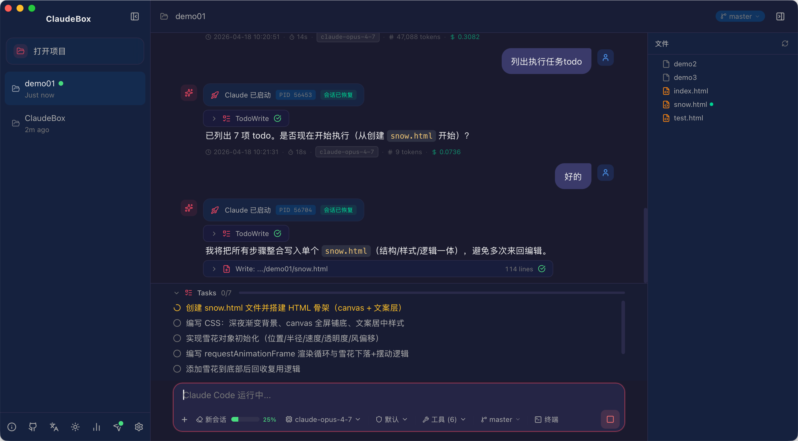

<p align="center">
  
</p>

<h1 align="center">ClaudeBox</h1>

<p align="center">
  <strong>Claude Code 原生桌面客户端</strong>
</p>

<p align="center">
  <a href="https://github.com/braverior/ClaudeBox/releases">
    
  </a>
  <a href="https://github.com/braverior/ClaudeBox/releases">
    
  </a>
  
  
  
</p>

<p align="center">
  <a href="#功能特性">功能特性</a> &bull;
  <a href="#安装">安装</a> &bull;
  <a href="#开发">开发</a> &bull;
  <a href="#架构">架构</a> &bull;
  <a href="#常见问题">常见问题</a>
</p>

<p align="center">
  简体中文 | <a href="./README.en.md">English</a>
</p>

---

ClaudeBox 将 [Claude Code](https://docs.anthropic.com/en/docs/claude-code) 封装为一个轻量级的原生桌面应用，基于 [Tauri v2](https://v2.tauri.app) 构建。它提供可视化的聊天界面，支持多项目 Claude Code 会话、交互式工具审批、文件附件、任务跟踪等功能 ——  无需离开桌面即可完成所有操作。

<p align="center">
  
</p>

## 功能特性

### 核心功能

- **多会话管理** — 同时打开多个项目文件夹，每个项目拥有独立的 Claude Code 会话。绿色指示灯标识正在运行的会话。
- **流式聊天界面** — 实时消息流，支持 Markdown 渲染、语法高亮代码块和 GitHub 风格 Markdown。
- **会话恢复** — 通过 Claude 的 Session ID 自动恢复对话上下文，应用重启后无需重新发送历史消息即可继续对话。
- **持久化存储** — 所有会话数据存储在 `~/.claudebox/data/`，不受应用更新和 WebView 重置影响（首次运行自动从 localStorage 迁移）。

### 交互式工具

- **工具审批卡片** — 以可视化卡片展示所有工具调用（Read、Write、Edit、Bash、Glob、Grep、WebFetch、WebSearch、NotebookEdit、Agent、Skill 等），支持批准/拒绝操作。
- **AskUserQuestion** — 以交互式表单呈现，包含可选选项和自定义文本输入。
- **计划模式 (ExitPlanMode)** — 显示 `.claude/plans/` 中的完整计划文件内容，供用户审阅后批准或拒绝执行。
- **Agent 子运行容器** — 嵌套的 Agent 工具调用被分组为可折叠的容器，显示进度、当前运行的工具和汇总信息。
- **扩展思考** — Claude 的思考/推理过程以可折叠区块展示，带有视觉标识。

### 附件与图片

- **文件附件** — 通过工具栏附加代码文件和图片。文本文件内嵌展示，图片传递给 Claude 的 Read 工具处理。
- **剪贴板图片粘贴** — 支持直接从系统剪贴板粘贴图片 (Ctrl/Cmd+V)。图片保存至 `~/.claudebox/tmp/` 并自动附加。超过 24 小时的临时文件在启动时自动清理。

### Git 集成

- **分支显示** — 当前 Git 分支显示在输入工具栏中。
- **分支切换** — 直接在应用内列出和切换本地分支，无需离开应用。

### 网络与代理

- **系统代理自动检测** — 自动检测系统代理设置：macOS 通过 `scutil --proxy`，Windows 通过注册表。区分 HTTP 和 SOCKS5 代理。
- **动态代理轮询** — 每 30 秒检测代理变化，支持动态代理切换（如 Clash、V2Ray）。
- **自定义 API 端点** — 可配置自定义 Base URL 用于 API 代理或兼容端点。

### 配置选项

- **模型与模式切换** — 在输入工具栏中按会话切换模型和权限模式（默认 / 自动 / 计划）。
- **模型验证** — 添加模型前通过 API 验证模型可用性。
- **工具白名单** — 按会话配置 Claude 可使用的工具（Read、Write、Edit、Glob、Grep、Bash 等）。
- **深色 & 浅色主题** — 从侧边栏一键切换深色和浅色主题。
- **国际化** — 支持英文和简体中文界面，覆盖 100+ 翻译条目。

### 项目工具

- **文件浏览器** — 内置文件树和文件查看面板，支持语法高亮、行号显示和一键复制。
- **任务看板** — 在输入区上方展示 Claude 的 `TodoWrite` 任务进度，包含完成度追踪和进行中指示器。
- **在终端中打开** — 快捷操作：在系统终端中打开项目文件夹。
- **调试面板** — 按 `Cmd+Shift+D` 切换。显示 Rust 后端和前端的彩色日志（info、warn、error、stdin、stdout、stderr、process），支持过滤和自动滚动。

### 更新与平台

- **自动更新** — 内置更新检查器，支持 Cloudflare Workers 代理和 GitHub Releases 回退。后台下载并显示进度，支持签名验证。
- **跨平台** — 支持 macOS（Apple Silicon + Intel）和 Windows。

## 安装

### Homebrew（macOS，推荐）

```bash
brew tap braverior/tap
brew install --cask claudebox
```

### 下载

从 [GitHub Releases](https://github.com/braverior/ClaudeBox/releases) 下载最新版本：

| 平台 | 文件 |
|------|------|
| macOS (Apple Silicon) | `ClaudeBox_x.x.x_aarch64.dmg` |
| macOS (Intel) | `ClaudeBox_x.x.x_x64.dmg` |
| Windows | `ClaudeBox_x.x.x_x64-setup.exe` |

### 前置依赖

- **Node.js** >= 18（运行 sidecar 桥接程序所需）
- 全局安装 **Claude Code CLI**：
  ```bash
  npm install -g @anthropic-ai/claude-code
  ```
- **Anthropic API Key** — 启动应用后在设置中配置

## 开发

### 环境要求

- [Node.js](https://nodejs.org/) >= 18
- [Rust](https://rustup.rs/)（stable 工具链）
- [Tauri v2 前置依赖](https://v2.tauri.app/start/prerequisites/)

### 启动开发

```bash
# 克隆仓库
git clone https://github.com/braverior/ClaudeBox.git
cd ClaudeBox

# 安装依赖
npm install

# 启动开发模式（启动 Tauri + Vite 开发服务器）
npx tauri dev
```

### 构建

```bash
# 构建 sidecar 桥接 + 前端 + Tauri 应用
npm run build:sidecar && npx tauri build
```

产物输出至 `src-tauri/target/release/bundle/`。

### 项目结构

```
ClaudeBox/
├── src/                          # React 前端
│   ├── components/
│   │   ├── chat/                 # ChatPanel, MessageBubble, InputArea,
│   │   │                         # ToolCallCard, CodeBlock, FileTree,
│   │   │                         # FileViewer, TaskBoard
│   │   ├── sidebar/              # Sidebar, SessionList, NewSessionDialog
│   │   ├── settings/             # SettingsDialog
│   │   └── debug/                # DebugPanel (Cmd+Shift+D)
│   ├── stores/                   # Zustand 状态管理
│   │   ├── chatStore.ts          # 会话、消息、流式状态
│   │   ├── settingsStore.ts      # 设置、主题、语言
│   │   └── taskStore.ts          # 任务跟踪
│   ├── lib/
│   │   ├── claude-ipc.ts         # Tauri IPC 封装（25+ 命令）
│   │   ├── stream-parser.ts      # 流事件类型定义
│   │   ├── storage.ts            # 基于文件的持久化存储
│   │   ├── i18n.ts               # 国际化 (en/zh)
│   │   ├── updater.ts            # 自动更新（支持多端点回退）
│   │   └── utils.ts              # 工具函数
│   └── index.css                 # Tailwind CSS v4 + 主题变量
├── src-tauri/                    # Rust 后端
│   └── src/
│       ├── claude.rs             # 进程管理、IPC 命令、
│       │                         # 代理检测、Git 操作
│       ├── lib.rs                # Tauri 应用初始化
│       └── main.rs               # 入口
├── sidecar/
│   └── bridge.mjs                # Node.js sidecar（Agent SDK 桥接）
└── .github/workflows/
    └── release.yml               # CI：构建 macOS + Windows 发布包
```

## 架构

```
┌─────────────────────────────────────────────────────────────┐
│                     React 前端                               │
│  ┌───────────┐  ┌───────────┐  ┌──────────┐  ┌──────────┐ │
│  │ ChatPanel │  │  Sidebar  │  │ Settings │  │  Debug   │ │
│  │ Messages  │  │ Sessions  │  │  Dialog  │  │  Panel   │ │
│  │ InputArea │  │ FileTree  │  │          │  │          │ │
│  └─────┬─────┘  └───────────┘  └──────────┘  └──────────┘ │
│        │  Zustand 状态管理 (chatStore, settingsStore)       │
├────────┼───────────────────────────────────────────────────┤
│        │  Tauri IPC (invoke / listen)                      │
├────────┼───────────────────────────────────────────────────┤
│        ▼         Rust 后端 (Tauri v2)                      │
│  ┌────────────────────────────────────────────────────┐    │
│  │ claude.rs                                          │    │
│  │  - 启动 / 管理 Node.js sidecar 子进程               │    │
│  │  - 通过 stdin/stdout 传输 NDJSON 协议               │    │
│  │  - 向前端发送流式事件                                │    │
│  │  - Shell 环境解析（PATH、API Key 等）               │    │
│  │  - 系统代理检测与注入                                │    │
│  │  - Git 分支操作                                     │    │
│  └──────────┬─────────────────────────────────────────┘    │
├─────────────┼──────────────────────────────────────────────┤
│             ▼     Node.js Sidecar (bridge.mjs)             │
│  ┌────────────────────────────────────────────────────┐    │
│  │ @anthropic-ai/claude-agent-sdk  query() API        │    │
│  │  - 从 stdin 接收 NDJSON 命令                        │    │
│  │  - 通过 stdout 输出流式事件                          │    │
│  │  - canUseTool 拦截: AskUserQuestion / ExitPlanMode  │    │
│  │  - 文件附件处理                                     │    │
│  │  - 会话恢复支持                                     │    │
│  └────────────────────────────────────────────────────┘    │
└─────────────────────────────────────────────────────────────┘
```

### 通信流程

**用户发送消息：**

1. React `InputArea` 调用 `handleSend()`
2. `chatStore` 存储用户消息，设置流式状态
3. `claude-ipc.ts` 调用 Rust `send_message` 命令
4. Rust 启动 `node bridge.bundle.mjs`，通过 stdin 写入 NDJSON `start` 消息
5. Sidecar 调用 Agent SDK 的 `query()`，将结果流式输出到 stdout
6. Rust 逐行读取 stdout，向前端发送 `claude-stream` 事件
7. `chatStore.handleStreamData` 解析事件，响应式更新消息

**交互式工具审批：**

1. Sidecar 的 `canUseTool` 回调拦截 `AskUserQuestion` / `ExitPlanMode`
2. 输出带 `requestId` 的 `ask_user` / `exit_plan` 事件
3. 前端在 `ToolCallCard` 中渲染交互式 UI
4. 用户响应后，前端调用 `sendResponse` IPC
5. Rust 将 JSON 响应写入 sidecar 的 stdin
6. Sidecar 解析响应并 resolve 对应的 Promise，SDK 继续执行

## 配置

点击侧边栏齿轮图标打开**设置**：

| 设置项 | 说明 |
|--------|------|
| **API Key** | Anthropic API 密钥（必填） |
| **Base URL** | 自定义 API 地址（可选，用于代理） |
| **Models** | 可选模型列表（添加前自动验证可用性） |
| **Claude CLI Path** | `claude` 二进制路径（默认自动检测） |
| **Theme** | 深色 / 浅色 |
| **Language** | 英文 / 中文 |

会话级设置在输入工具栏中调整：
- **模型** — 选择当前会话使用的模型
- **权限模式** — 默认（手动审批）/ 自动 / 计划
- **允许的工具** — 逐个开关各工具

数据存储在 `~/.claudebox/data/`，跨应用更新持久保存。

## 快捷键

| 快捷键 | 操作 |
|--------|------|
| `Enter` | 发送消息 |
| `Shift+Enter` | 输入换行 |
| `Cmd/Ctrl+V` | 从剪贴板粘贴图片 |
| `Cmd+Shift+D` | 切换调试面板 |

## 常见问题

**Q：需要安装 Claude Code CLI 吗？**
A：是的。ClaudeBox 使用 [Agent SDK](https://www.npmjs.com/package/@anthropic-ai/claude-agent-sdk)，依赖 Claude Code（`@anthropic-ai/claude-code`）并要求其在系统 PATH 中可访问。

**Q：会话数据存储在哪里？**
A：会话和消息持久化存储在 `~/.claudebox/data/`，独立于 WebView 存储，应用更新后不会丢失。

**Q：可以使用自定义 API 端点吗？**
A：可以。在设置中配置 **Base URL** 即可指向你的代理或兼容的 API 端点。

**Q：支持系统代理吗？**
A：支持。ClaudeBox 自动检测系统代理设置（HTTP/SOCKS5），并注入到 sidecar 环境中。每 30 秒轮询一次代理变化，因此切换代理工具（Clash、V2Ray 等）后会自动生效。

**Q：macOS 提示应用已损坏/无法打开？**
A：在终端运行 `xattr -cr /Applications/ClaudeBox.app` 以移除隔离标记。

**Q：能否恢复之前的对话？**
A：可以。ClaudeBox 自动保存 Claude 的 Session ID。在已有会话中发送新消息时，对话会自动恢复完整上下文。

## 参与贡献

1. Fork 本仓库
2. 创建功能分支（`git checkout -b feature/my-feature`）
3. 提交更改（`git commit -m 'Add my feature'`）
4. 推送分支（`git push origin feature/my-feature`）
5. 发起 Pull Request

## 许可证

[MIT](LICENSE)

---

<p align="center">
  基于 <a href="https://v2.tauri.app">Tauri</a> + <a href="https://react.dev">React</a> + <a href="https://docs.anthropic.com/en/docs/claude-code">Claude Code</a> 构建
</p>
